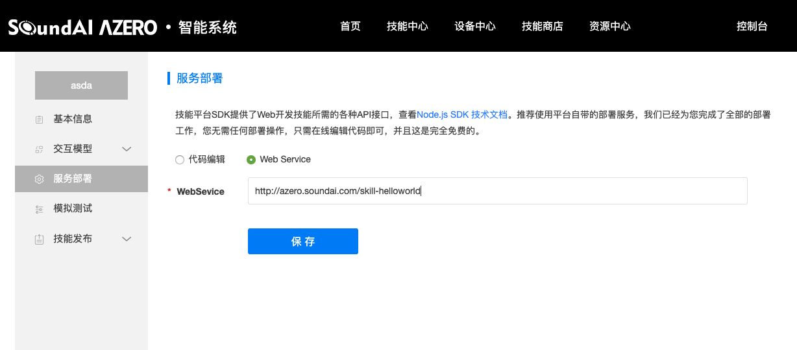

# 创建自定义技能

体验完Azero的基本功能和第三方技能带来的新功能，您还可以选择按照此文档快速的创建并开发自己的技能来实现特定的需求，完善自定义的体验。


## Skill和Azero


如上图所示，自定义skill本质上是一个web service, 这个service将会接收到Azero 解析的客户语音命令中所包含的实际意图 ,skill根据则根据给到的不同的意图进行答复。

在无屏设备上，可以直接给出返回文字即可，Azero会将其转换成语音流给到端侧，设备只需要将其播放出来，就完成了一个简单的语音交互；在有屏的设备上，则需要提供更多的信息，如需要显示的文字、图片等，可按照固定的模板给出，端侧收到后对该模板进行显示即可。


## 创建技能

实现一个自定义技能，首先要到Azero 开发者网站上去创建自己的技能。

创建技能的过程可以参照 [ `技能接入介绍`](https://azero.soundai.com/docs/document)>`自定义技能`  文档步骤去创建。

Azero开发者网站上目前支持使用Node.js SDK去开发并直接进行部署，除此之外，我们还支持部署在第三方服务器上的Web Service。  

## 私有部署

在独立的云服务器上进行私有化部署 ，只要遵循Azero的skill协议实现Web Service ,这样Azero 即可与您部署在第三方服务器上的技能进行通信和交互， 为了便易，我们也提供了多种SDK供Skill 去使用，以下将为您展示如何利用java SDK去部署在自有服务器上。

### 必要条件

1. 公有云服务器，如阿里云、腾讯云等
2. Tomcat server. [Download and installation instructions](https://tomcat.apache.org/download-80.cgi)

### 创建Spring工程

打开intellij-idea，创建Spring Initializr工程

1）`File` >`New` > `Project`  > `Spring Initializr` > `Next`

2）输入Group ,示例：com.soundai.skill

3）输入ArtifactId，根据技能业务去命名，此处示例：photography

4）选择"Packaging" 为 "war"

### SDK依赖

在工程的pom.xml文件中添加对于ask-sdk的依赖：

```
<dependency>
    <groupId>com.amazon.alexa</groupId>
    <artifactId>ask-sdk</artifactId>
    <version>2.18.0</version>
    <scope>compile</scope>
</dependency>
```

Maven-central可以查看最新的SDK版本：[ask-sdk](https://mvnrepository.com/artifact/com.amazon.alexa/ask-sdk)


### 创建SkillServlet

1）创建Servlet类，继承SkillServlet

SkillServlet类注册了一个skill实例，提供doPost请求的反序列化方法，在调用技能之前验证输入请求，并负责生成序列化的响应。

withSkillId需要配置您在开发者网站上创建技能时，Azero 分配的技能id.

```                          java
public class HelloWorldSkillServlet extends SkillServlet {

    public HelloWorldSkillServlet() {
        super(getSkill());
    }

    private static Skill getSkill() {
        return Skills.standard()
                .addRequestHandlers (
                        new HelloWorldIntentHandler()) 
                // Add your skill id below
                .withSkillId("")
                .build();
    }

}
```

增加不同类型的request hanlder可以参考如下 [request-handlers](https://developer.amazon.com/zh/docs/alexa-skills-kit-sdk-for-java/handle-requests.html#request-handlers)

​                  

2）创建HelloWorldIntentHandler，处理配置的意图

```java
public class HelloWorldIntentHandler implements IntentRequestHandler {
  
    @Override
    public boolean canHandle(HandlerInput handlerInput, IntentRequest intentRequest) {
        return "HELLO_WOLRD".equals(intentRequest.getIntent().getName());
    }

    @Override
    public Optional<Response> handle(HandlerInput handlerInput, IntentRequest intentRequest) 		{
      	String speechText = "你好，这是我的技能Hello world";
        return handlerInput.getResponseBuilder()
                .withSpeech(speechText)
                .withSimpleCard("Photography", speechText)
                .build();
    }
}
```

上述代码中的"HELLO_WOLRD"即为Azero开发者网站上面配置的意图的标识，通过该标识可以判断是否是你配置的意图，从而选择是否进行进一步的处理。

如果是你配置的意图“HELLO_WOLRD”，则进入到handle函数进行进一步的处理 ，此处展示的示例直接进行了返回，返回了一个tts 播报“你好，这是我的技能Hello world”，Azero 会将该文本转换成语音，并给到端侧sdk由端侧sdk自动播放出来，对于SpeechText这种response, 端侧不用进行任何的处理。

到这步，您已经可以简单的实现从端侧语音请求，触发意图到skill，再从skill 给到端侧应答，端侧播报（显示）skill应答的全过程。

更多response的构建可以参考如下 [response-builder](https://developer.amazon.com/zh/docs/alexa-skills-kit-sdk-for-java/build-responses.html#response-builder)

3）解析槽位

关于槽位的介绍，可参考[ `技能接入介绍`](https://azero.soundai.com/docs/document)>`自定义技能` > `任务型技能` > `创建交互模型`中内容进行了解，此处不做详述。

接下来我们主要介绍使用java sdk收到 配置的意图，如何解析其中的槽位信息从而获取关键的参数化内容，从而可以针对性的对语音意图做出应答。

假设为“HELLO_WOLRD” 意图配置了如下的槽位：


针对上述槽位，您可以从代码中去获取，并进行判断：

```java
@Override
public Optional<Response> handle(HandlerInput handlerInput, IntentRequest intentRequest) {
        Slot slot = intentRequest.getIntent().getSlots().get("SlotName");
        String value = slot.getValue();

        JSONObject jsonObject = JSON.parseObject(value);
        JSONObject parameterObject = jsonObject.getJSONObject("parameters");    // 配置的词槽都在此字段里面
        String fromcity = parameterObject.getString("fromcity");
	      if("北京".equals(fromcity)){
        		return handlerInput.getResponseBuilder()
                .withSpeech("您的出发城市为北京，我们为您提供北京市的出行服务指南！")
                .build();
        }else{
          	return handlerInput.getResponseBuilder()
                .withSpeech("抱歉，该城市还未开通该服务！")
                .build();
        }

    }
```


### 使用模板

为了更好给将技能的内容在有屏设备上给给用户展现，Azero提供了多种预置模板供开发者使用。技能开发者只需将想要展示的内容在所提供的模板中进行设置，根据技能的实际应用场景选择最为适合的模板即可，除此之外，如果预设模板无法满足您的需求，还可以使用自定义的模板去实现更多的特殊需求。

*注：若无屏设备使用你为有屏设备创建的技能时，同样可以正常使用，只是无屏SDK没有对template进行处理，只进行TTS 回复的播放。

#### 预设模板

预设模板的简介可查看 [`文档中心`](https://azero.soundai.com/docs/document)> `开发文档` > `技能接入协议` > `自定义技能接入协议` > `有屏设备展示`。

使用预设模板可以参考如下Template3 为例构造预设模板：

```java
/**
     * Helper method to create a body template 3
     * @param title the title to be displayed on the template
     * @param primaryText the primary text to be displayed on the template
     * @param secondaryText the secondary text to be displayed on the template
     * @param image  the url of the image
     * @return Template
     */
private Template getBodyTemplate3(String title, String primaryText, String secondaryText, Image image) {
        return BodyTemplate3.builder()
                .withImage(image)
                .withTitle(title)
                .withTextContent(getTextContent(primaryText, secondaryText))
                .build();
}       
  
String title = "Airplane Facts";
String primaryText = facts.get(key);
//FIXME: If you would like to display additional text, please set the secondary text accordingly
String secondaryText = "";
String speechText = "<speak> " + primaryText + "<break time=\"1s\"/>  Would you like to hear another airplane fact?" + " </speak>";
String imageUrl = images.get(key);
Image image = getImage(imageUrl);

Template template = getBodyTemplate3(title, primaryText, secondaryText, image);
```

构造完成后添加到response：

```java
return input.getResponseBuilder()
     .withSpeech(speechText)
     .withSimpleCard(title, primaryText)
     .addRenderTemplateDirective(template)
     .withReprompt(speechText)
     .build();
```


#### 自定义模板

特殊情况下，预设的模板无法满足需求，这时候就需要使用自定义模板将内容下发给端侧显示给到用户。

自定义模板仅需要参考预设模板实现即可，如 [BodyTemplate1](https://github.com/alexa/alexa-apis-for-java/blob/master/ask-sdk-model/src/com/amazon/ask/model/interfaces/display/BodyTemplate1.java) ，完成自定义模板之后即可如上述预设模板一样使用，提供更多可定制化的内容显示。

如Azero_Sample_for_Android 示例程序中提供的摄影skill的作品展示使用的自定义模板效果如下：


*注：如需使用自定义模板，必须配合端侧进行显示，否则无法体验新模板。*


#### 端侧展示模板

 当您按照上述使用了模板来回复端侧request的时，端侧会收到固定格式的json串，通过解析这些固定json,可以完成想要内容的显示，想要开发新的skill或者为skill增加新的功能时，只要使用这些模板下发想要展示的内容即可。

使用Azero Android SDK时，可以通过如下方式获取skill下发的模板:

1. 获取Template handler

   ```
   TemplateRuntimeHandler templateRuntimeHandler = (TemplateRuntimeHandler) AzeroManager.getInstance().getHandler(AzeroManager.TEMPLATE_HANDLER);
   ```

   

2. 注册监听TemplateDispatchedListener

   ```
   templateRuntimeHandler.registerTemplateDispatchedListener(new TemplateDispatcher() {
               @Override
               public void renderTemplate(String payload, String type) {
                   try {
                       JSONObject template = new JSONObject(payload);
                       switch (type) {
                           case "BodyTemplate1":
                               mTemplateViewController.showDisplayCard(template, TemplateViewController.BODY_TEMPLATE1);
                               break;
                           case "BodyTemplate2":
                               mTemplateViewController.showDisplayCard(template, TemplateViewController.BODY_TEMPLATE2);
                               break;
                               }
                        }
                }
    }
   ```

其中type为模板的类型，如使用的预设模板“BodyTemplate3”等， 通过type区分不同的template之后可以根据不同的类型可以使用不同的activity 进行显示。

3. 解析Template，并进行显示

步骤2中解析的template json对象即为模板的内容，可以根据其json key去获取设定的value值，然后去启动不同的activity去显示模板的内容，该部分可以参考Azero_Sample_for_Android 代码示例。


### 部署到私有服务器

完成上述步骤后，一个skill基本开发完成，下一步要部署到云服务器。

1. 使用命令行 运行`mvn package`，或者使用idea的打包命令可以将servlet进行打包。
2. 将打好的war包放置到Tomcat服务器（如阿里云）的安装目录
3. 设置好访问路径，确保外网可以访问到servlet的url 
4. 启动Tomcat服务


##测试技能并完成发布 

1. 配置WebService访问地址

将上一步servlet的公网访问地址填写到技能设置中的 `服务部署` > `WebService` 中，点击保存即可。

​		

2. 部署完成后，可在`模拟测试` 输入文字，模拟语音进行测试

   

3. 测试完成后，即可在 `技能发布` > `发布上线` 中申请上线。申请上线后，等待管理员审核通过后即可上线。技能上线后在申请的设备中添加该技能，添加后即可在设备上实际体验技能的实际效果。


## 参考

1. [ASK SDK for Java 2.21.0 API](http://ask-sdk-java-javadocs.s3-website-us-west-2.amazonaws.com/)

2. [skill-sample-java-fact](https://github.com/alexa/skill-sample-java-fact)